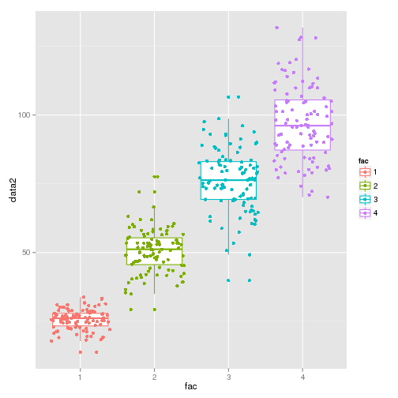

# What's the smallest amount you can't make with 5 coins ?

My amazing, awesome wife often comes up with the little puzzles for our
amazing children, and this one seemed destined to be solved in R.  So, 
using up to 5 coins (1p, 2p, 5p, 10p, 20p and 50p) first she asked our 
kids whether they could make every value up to 50p, and then what the 
smallest value they couldn't make was.

Here's my R solution (which took about 5mins less than our daughter took 
to answer the first question)


```r
# What Amounts can't you make using up to 5 coins 1p to 50p
# 
# Author: Paul Hurley
library(ggplot2)
library(plyr)

# Define our coins
coins <- as.factor(c(0, 1, 2, 5, 10, 20, 50))

# build a list of all the possibilities
possibilities <- expand.grid(coin1 = coins, coin2 = coins, coin3 = coins, coin4 = coins, 
    coin5 = coins)

# calculate the result
possibilities$total <- as.numeric(as.character(possibilities$coin1)) + as.numeric(as.character(possibilities$coin2)) + 
    as.numeric(as.character(possibilities$coin3)) + as.numeric(as.character(possibilities$coin4)) + 
    as.numeric(as.character(possibilities$coin5))

# define our target values
targets <- 1:250

# what amounts aren't possible
targets[!targets %in% possibilities$total]
```

```
##  [1]  88  89  98  99 118 119 128 129 133 134 136 137 138 139 143 144 146
## [18] 147 148 149 158 159 163 164 166 167 168 169 173 174 176 177 178 179
## [35] 181 182 183 184 185 186 187 188 189 191 192 193 194 195 196 197 198
## [52] 199 203 204 206 207 208 209 211 212 213 214 215 216 217 218 219 221
## [69] 222 223 224 225 226 227 228 229 230 231 232 233 234 235 236 237 238
## [86] 239 240 241 242 243 244 245 246 247 248 249
```


So, the smallest value we can't make is 
`88`

We can even produce a table of the number of ways to make each
 number, and a graph

```r
tableofpossibilities <- ddply(.data = possibilities, .(total), nrow)

ggplot(data = possibilities, aes(x = total)) + geom_histogram(binwidth = 1)
```

 


Then when I triumphantly told her, she asked, 'what about 4 coins ?'

```r
# How about 4 coins build a list of all the possibilities
fourpossibilities <- expand.grid(coin1 = coins, coin2 = coins, coin3 = coins, 
    coin4 = coins)

# calculate the result
fourpossibilities$total <- as.numeric(as.character(fourpossibilities$coin1)) + 
    as.numeric(as.character(fourpossibilities$coin2)) + as.numeric(as.character(fourpossibilities$coin3)) + 
    as.numeric(as.character(fourpossibilities$coin4))

# what values can't be made ?
targets[!targets %in% fourpossibilities$total]
```

```
##   [1]  38  39  48  49  68  69  78  79  83  84  86  87  88  89  93  94  96
##  [18]  97  98  99 108 109 113 114 116 117 118 119 123 124 126 127 128 129
##  [35] 131 132 133 134 135 136 137 138 139 141 142 143 144 145 146 147 148
##  [52] 149 153 154 156 157 158 159 161 162 163 164 165 166 167 168 169 171
##  [69] 172 173 174 175 176 177 178 179 180 181 182 183 184 185 186 187 188
##  [86] 189 190 191 192 193 194 195 196 197 198 199 201 202 203 204 205 206
## [103] 207 208 209 210 211 212 213 214 215 216 217 218 219 220 221 222 223
## [120] 224 225 226 227 228 229 230 231 232 233 234 235 236 237 238 239 240
## [137] 241 242 243 244 245 246 247 248 249 250
```

So, the answer is `38`and a graph

```r

ggplot(data = fourpossibilities, aes(x = total)) + geom_histogram(binwidth = 1)
```

 

