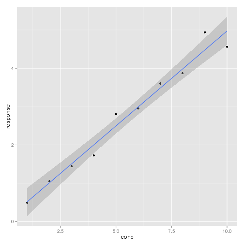
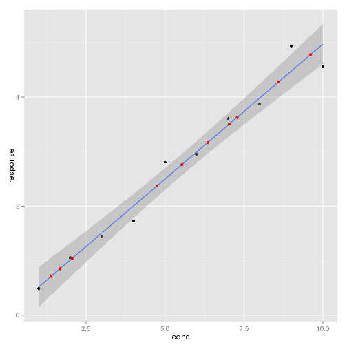

# Finding the Inverse of a Quadratic Equation 

## The Calibration Problem 

I found myself trying to build some R scripts for calculating an unknown 
concentration using an external calibration line.  This is a basic technique 
in science, where you measure some response for a range of known samples 
(your calibrators) and for your unknown samples.  You then construct a 
calibration line of response against known concentration, and read off 
your unknown concentrations against their measured response.  Easy.

This is easy in R (insert R example)


```r
# Create a calibration dataset
simpleregression <- data.frame(conc = 1:10, response = (1:10 * rnorm(10, mean = 0.5, 
    sd = 0.05)))
simpleregression
```

```
##    conc response
## 1     1    0.490
## 2     2    1.055
## 3     3    1.447
## 4     4    1.729
## 5     5    2.808
## 6     6    2.950
## 7     7    3.604
## 8     8    3.870
## 9     9    4.939
## 10   10    4.562
```

```r

# buid and display the regression
lmreg <- lm(data = simpleregression, response ~ conc)
summary(lmreg)
```

```
## 
## Call:
## lm(formula = response ~ conc, data = simpleregression)
## 
## Residuals:
##     Min      1Q  Median      3Q     Max 
## -0.4119 -0.1000 -0.0349  0.0977  0.4598 
## 
## Coefficients:
##             Estimate Std. Error t value Pr(>|t|)    
## (Intercept)   0.0214     0.1850    0.12     0.91    
## conc          0.4953     0.0298   16.62  1.7e-07 ***
## ---
## Signif. codes:  0 '***' 0.001 '**' 0.01 '*' 0.05 '.' 0.1 ' ' 1 
## 
## Residual standard error: 0.271 on 8 degrees of freedom
## Multiple R-squared: 0.972,	Adjusted R-squared: 0.968 
## F-statistic:  276 on 1 and 8 DF,  p-value: 1.74e-07
```

```r
regressionplot <- ggplot(data = simpleregression, aes(x = conc, y = response)) + 
    geom_point() + stat_smooth(method = lm)
print(regressionplot)
```

 

```r

# Create some unknown data
unknowns <- data.frame(response = runif(10, min = 0, max = 5))
unknowns
```

```
##    response
## 1    2.7626
## 2    3.5057
## 3    4.2794
## 4    3.1713
## 5    3.6301
## 6    4.7805
## 7    1.0413
## 8    2.3739
## 9    0.7119
## 10   0.8508
```

```r

# Calculate uknown concentration using regression coeficients y=mc+c, so
# x=(y-c)/m
unknowns$predconc <- (unknowns$response - coef(lmreg)[[1]])/coef(lmreg)[[2]]
unknowns
```

```
##    response predconc
## 1    2.7626    5.535
## 2    3.5057    7.035
## 3    4.2794    8.597
## 4    3.1713    6.360
## 5    3.6301    7.286
## 6    4.7805    9.609
## 7    1.0413    2.059
## 8    2.3739    4.750
## 9    0.7119    1.394
## 10   0.8508    1.675
```

```r
regressionplot + geom_point(data = unknowns, aes(x = predconc, y = response), 
    colour = "red")
```

 


It gets slightly more difficult in this case because of two things; 
Quadratic Regressions and Weighting.  My calibration line was possibly quadratic
so I was using a quadratic regression.  I also wanted to weight the responses
in response to their predicted variability, in my case weighting would be 
proportional to 1/Concentration^2.

However, this now requires you to find the inverse of the resulting quadratic 
equation to back calculate the concentrations.  You can't just reverse the regression 
because then the weighting doesn't work.

In addition, a quadratic regression can have two given values for x at a given y, 
and we're only interested in one, so I wrote a small function to find the inverse of
a quadratic equation in a given interval.


```r

#' Calculate the inverse of a quadratic function y=ax^2+bx+c (ie find x when given y)
#' Gives NaN with non real solutions
#'
#' @param a The x coefficient
#' @param b The x^2 coefficient
#' @param c The Intercept
#' @param y The y value at which the roots should be found
#' @param roots To select which roots are required, 'both' will give both, or 'min' or 'max'
#' @param xmin The minimum X value to be considered
#' @param xmax The maximum X value to be considered
#' @param na.rm Should NA's be ignored
#' @returnType
#' @return A Vector containing the calculated x values at the given y, Imaginary values given as NaN
#' @author Paul Hurley
#' @export
#' @examples
#' invquad(1,1,-10,0)
#' invquad(0.1,0.01,-0.5,7,roots='max', xmin=1, xmax=15)
invquad <- function(a, b, c, y, roots = "both", xmin = (-Inf), xmax = (Inf), 
    na.rm = FALSE) {
    root1 <- sqrt((y - (c - b^2/(4 * a)))/a) - (b/(2 * a))
    root2 <- -sqrt((y - (c - b^2/(4 * a)))/a) - (b/(2 * a))
    root1 <- ifelse(root1 < xmin, NA, root1)
    root1 <- ifelse(root1 > xmax, NA, root1)
    root2 <- ifelse(root2 < xmin, NA, root2)
    root2 <- ifelse(root2 > xmax, NA, root2)
    if (roots == "both") {
        result <- c(root1, root2)
        if (na.rm) 
            result <- ifelse(is.na(root1), root2, result)
        if (na.rm) 
            result <- ifelse(is.na(root2), root1, result)
        if (na.rm) 
            result <- ifelse(is.na(root1) & is.na(root2), NA, result)
    }
    if (roots == "min") 
        result <- pmin(root1, root2, na.rm = TRUE)
    if (roots == "max") 
        result <- pmax(root1, root2, na.rm = TRUE)
    return(result)
}

# Some examples
invquad(1, 1, -10, 0)
```

```
## [1]  2.702 -3.702
```

```r

invquad(0.1, 0.01, -0.5, 7, roots = "max", xmin = 1, xmax = 15)
```

```
## [1] 8.61
```

