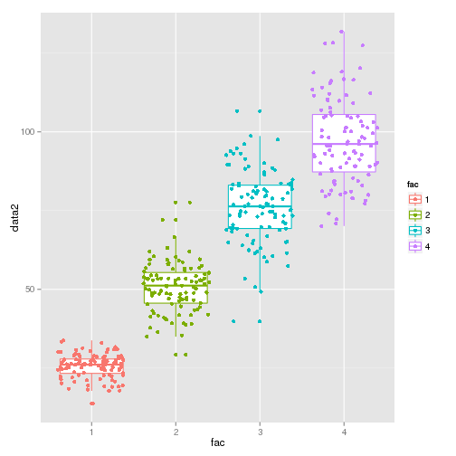

Creating SVG Plots from R
========================================================

I recently wanted to create a ggplot that I could then 'tweak' furthur.  This is my solution, to create an .svg file which can be loaded into a suitable application (I prefer Inkscape) and furthur edited / tweaked.


```r
# Build an example Plot
library(ggplot2)
dataframe <- data.frame(fac = factor(c(1:4)), data1 = rnorm(400, 100, sd = 15))
dataframe$data2 <- dataframe$data1 * c(0.25, 0.5, 0.75, 1)

testplot <- qplot(x = fac, y = data2, data = dataframe, colour = fac, geom = c("boxplot", 
    "jitter"))
testplot
```

 


```r
# Produce a PNG plot
library(Cairo)
Cairo(800, 800, file = "cairo_3.png", type = "png", bg = "transparent", pointsize = 12, 
    units = "px", dpi = 200)
testplot
```

 

```r
dev.off()
```

```
## pdf 
##   2
```


```r
# Produce an svg file
library(Cairo)
Cairo(800, 800, file = "cairo_2.svg", type = "svg", bg = "transparent", pointsize = 12, 
    units = "in", dpi = 400, width = 20, height = 20)
testplot
```

 

```r
dev.off()
```

```
## pdf 
##   2
```

